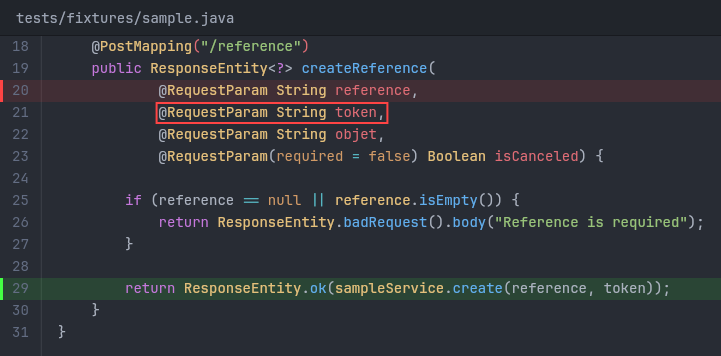
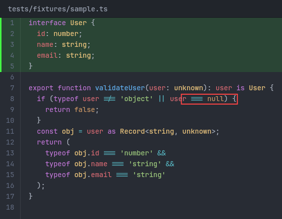
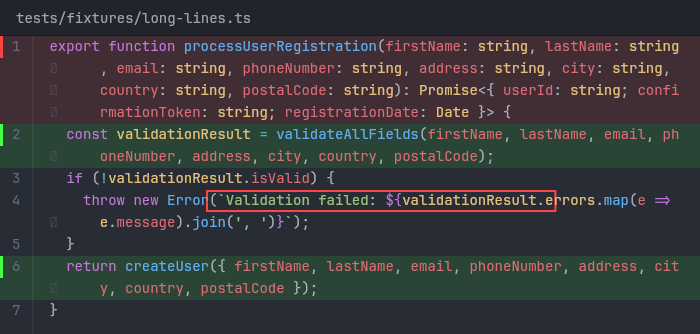
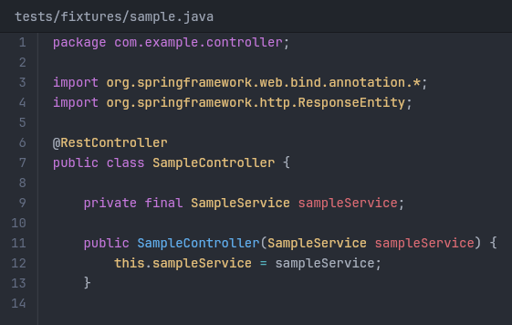

<h1 align="center">snipshot</h1>

---
<p align="center">
  <strong>Generate beautiful PNG screenshots of code snippets from the command line.</strong><br>
  Syntax highlighting, line numbers, and colored annotations — no browser required.
</p>

---

<p align="center">
  
</p>

---

## Features

- **Syntax highlighting** for 200+ languages via [Shiki](https://shiki.style) (VS Code-quality tokenization)
- **Line numbers** with proper gutter alignment
- **Red/green highlights** — full lines or precise column ranges
- **Word wrap** with `--max-width` for report-friendly output
- **Automatic language detection** from file extension
- **Dark theme** (One Dark Pro)
- **Offline** — everything runs locally, no network needed
- **Standalone binaries** for Linux, Windows, and macOS (via Bun compile)

## Install

```bash
# npm (requires Node.js >= 18)
npm install -g snipshot

# or run directly
npx snipshot <file> --lines <range>
```

## Usage

```bash
snipshot <file> --lines <start>-<end> [options]
```

### Options

| Option | Description |
|---|---|
| `--lines <range>` | Line range to capture, e.g. `42-56` **(required)** |
| `--highlight-red <spec>` | Highlight in red (repeatable) |
| `--highlight-green <spec>` | Highlight in green (repeatable) |
| `--max-width <pixels>` | Max image width — enables word wrap |
| `--output <path>` | Output file path (default: `<name>_L<start>-<end>.png`) |
| `--root <path>` | Project root for relative path display |

### Highlight format

```
47           # entire line 47
47-50        # lines 47 through 50
47:12-38     # line 47, columns 12 to 38
```

### Examples

```bash
# Basic screenshot
snipshot src/App.java --lines 42-56

# With highlights
snipshot src/App.java --lines 42-56 --highlight-red 47 --highlight-green 50

# Column-precise highlight
snipshot src/App.java --lines 42-56 --highlight-red 47:12-38

# Word wrap for reports
snipshot src/App.java --lines 1-20 --max-width 700

# Custom output path
snipshot src/App.java --lines 42-56 --output screenshot.png
```

## Examples

**TypeScript with interface highlight and column annotation:**

<p align="center">
  
</p>

**Word wrap with mixed highlights (--max-width 700):**

<p align="center">
  
</p>

**Clean output without highlights:**

<p align="center">
  
</p>

## Standalone binaries

Pre-built binaries include the Bun runtime — no Node.js installation needed on the target machine.

### Download

Grab the archive for your platform from [Releases](../../releases), extract it, and run:

```bash
./snipshot src/App.java --lines 10-30
```

### Build from source

Requires [Bun](https://bun.sh):

```bash
# All platforms (linux, win, mac-intel, mac-arm)
npm run build:standalone

# Specific platform
node scripts/build-standalone.mjs linux
node scripts/build-standalone.mjs win
node scripts/build-standalone.mjs mac-arm

# Multiple
node scripts/build-standalone.mjs linux,win
```

Output goes to `standalone/snipshot-<platform>/`. Each directory is self-contained.

**Install system-wide (Linux/macOS):**

```bash
sudo cp -r standalone/snipshot-linux-x64 /opt/snipshot
sudo ln -s /opt/snipshot/snipshot /usr/local/bin/snipshot
```

## How it works

1. Reads the **full source file** (not just the requested lines) to ensure accurate syntax highlighting
2. Tokenizes with [Shiki](https://shiki.style) using the One Dark Pro theme
3. Renders to a canvas with [@napi-rs/canvas](https://github.com/nickel-rs/canvas) (Skia-based, no browser needed)
4. Exports as PNG

The font used is [JetBrains Mono](https://www.jetbrains.com/lp/mono/) (bundled).

## Development

```bash
git clone <repo>
cd snipshot
npm install

npm run build        # compile TypeScript
npm test             # run tests (29 tests)
npm run test:watch   # watch mode
```

## License

MIT
