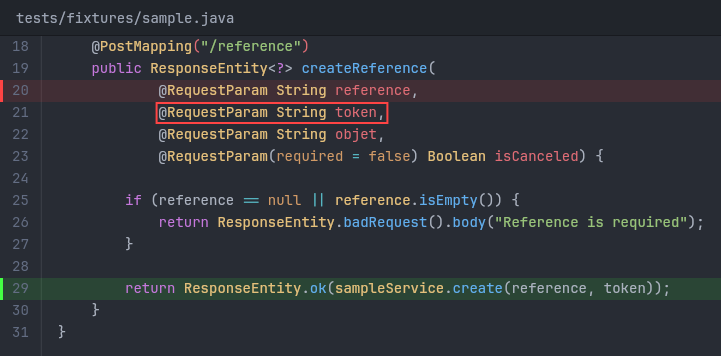
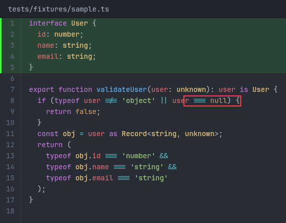
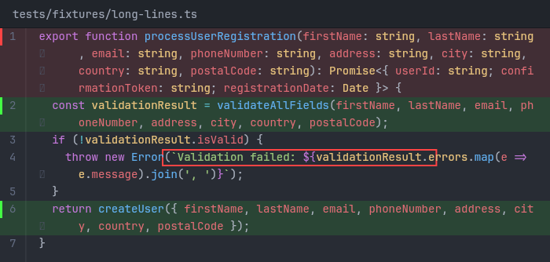
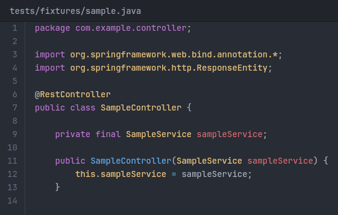
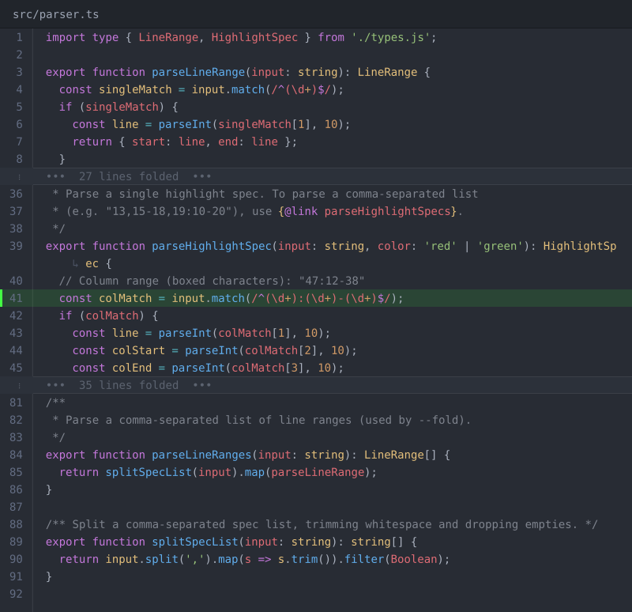
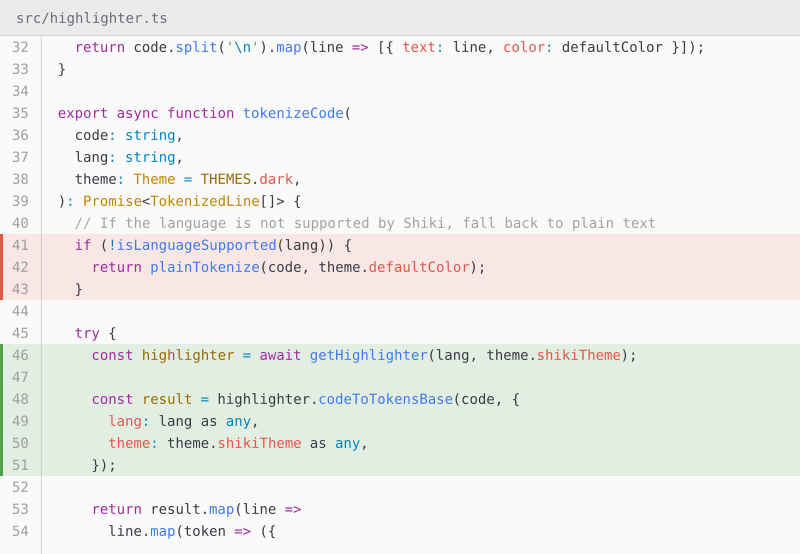
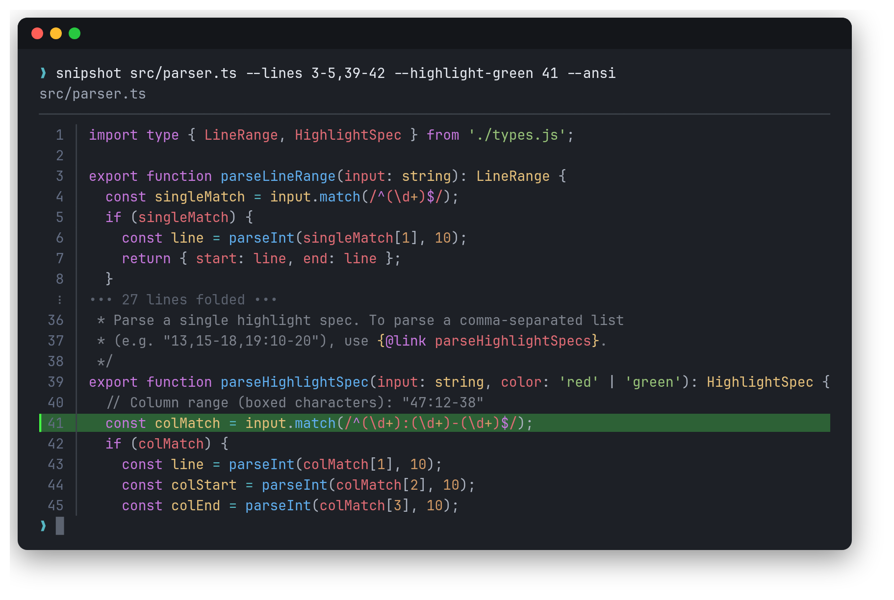

<h1 align="center">snipshot</h1>

<p align="center">
  <a href="https://www.npmjs.com/package/snipshot"></a>
  <a href="https://github.com/9pings/snipshot/blob/master/LICENSE"></a>
  <a href="https://www.npmjs.com/package/snipshot"></a>
  <a href="https://github.com/9pings/snipshot/actions/workflows/ci.yml"></a>
</p>

---
<p align="center">
  <strong>Generate beautiful screenshots of code snippets from the command line.</strong><br>
  PNG, SVG, or ANSI terminal output — syntax highlighting, line numbers, and colored annotations, no browser required.
</p>

---

<p align="center">
  
</p>

---

## Features

- **Syntax highlighting** for 200+ languages via [Shiki](https://shiki.style) (VS Code-quality tokenization)
- **Line numbers** with proper gutter alignment
- **Red/green highlights** — full lines or precise column ranges
- **Multiple ranges** — `--lines 10-14,42-56` captures several sections, folding the gaps automatically
- **Fold/collapse** line ranges to hide boilerplate with `--fold`
- **Context lines** — 3 lines around your selection by default (`--context` / `--no-context`)
- **Page-fit guard** — errors past 70 rendered rows so snippets fit on a page (`--max-lines` / `--no-max-lines`)
- **Page-width word wrap** — long lines wrap to fit a document by default (`--max-width` / `--no-max-width`)
- **Automatic language detection** from 150+ file extensions, with graceful plaintext fallback for unknown types
- **Dark & light themes** — One Dark Pro (default) or One Light via `--theme`
- **SVG output** — same layout as a crisp, scalable vector file via `--svg`
- **Terminal output** — print the snippet as ANSI-colored text (24-bit color) via `--ansi`
- **Offline** — everything runs locally, no network needed
- **Standalone binaries** for Linux, Windows, and macOS (via Bun compile), built and attached to [Releases](../../releases) automatically

## Install

```bash
# npm (requires Node.js >= 18)
npm install -g snipshot

# or run directly
npx snipshot <file> --lines <ranges>
```

## Usage

```bash
snipshot <file> --lines <ranges> [options]
```

### Options

| Option | Description |
|---|---|
| `--lines <ranges>` | Line range(s) to capture, e.g. `42-56` or `10-14,42-56` (gaps between ranges are folded) **(required)** |
| `--highlight-red <specs>` | Red highlights — comma-separated and/or repeatable |
| `--highlight-green <specs>` | Green highlights — comma-separated and/or repeatable |
| `--fold <ranges>` | Collapse line ranges into a single indicator row — comma-separated and/or repeatable |
| `--context <n>` | Lines of context before/after `--lines`, clamped to the file (default: `3`) |
| `--no-context` | Show exactly the requested lines |
| `--max-lines <n>` | Error if the result exceeds this many rows so it fits a page (default: `70`) |
| `--no-max-lines` | Disable the rows limit |
| `--theme <name>` | Color theme: `dark` (default) or `light` |
| `--max-width <pixels>` | Max image width with word wrap (default: `800` ≈ a page width) |
| `--no-max-width` | Disable word wrap (image grows to the longest line) |
| `--svg` | Write an SVG document instead of a PNG (default name: `<name>_L<start>-<end>.svg`) |
| `--ansi` | Print the snippet to stdout as ANSI-colored text (24-bit color) instead of writing a file; with `--output`, saves the colored text there |
| `--output <path>` | Output file path (default: `<name>_L<start>-<end>.png` or `.svg`) |
| `--root <path>` | Project root for the header path (default: nearest `.git` above the file, else the current directory) |

Running `snipshot` with no arguments prints this help.

### Highlight / fold format

Each `--highlight-*` and `--fold` flag takes one or more comma-separated targets (and can be repeated):

```
47           # entire line 47
47-50        # lines 47 through 50
47:12-38     # line 47, columns 12 to 38 (highlights only — draws a box)
13,15-18     # several at once in a single flag
```

All numbers are 1-based and inclusive.

### Examples

```bash
# Basic screenshot (3 context lines added automatically)
snipshot src/App.java --lines 42-56

# Multiple highlights in one flag
snipshot src/App.java --lines 42-56 --highlight-red 47,50-52 --highlight-green 55:12-38

# Several line ranges at once — the gaps between them are folded automatically
snipshot src/App.java --lines 10-14,42-56,80-95

# Wider lines (override the default page-width wrap), or disable wrapping
snipshot src/App.java --lines 1-20 --max-width 1100
snipshot src/App.java --lines 1-20 --no-max-width

# Fold boilerplate to focus on what matters
snipshot src/App.java --lines 1-80 --fold 5-30,60-70

# Exactly the requested lines, no context
snipshot src/App.java --lines 42-56 --no-context

# Large extract that exceeds the 70-row page-fit limit
snipshot src/App.java --lines 1-200 --no-max-lines

# Light theme
snipshot src/App.java --lines 42-56 --theme light

# Custom output path
snipshot src/App.java --lines 42-56 --output screenshot.png

# SVG instead of PNG (scalable, small file)
snipshot src/App.java --lines 42-56 --svg

# ANSI-colored output straight to the terminal
snipshot src/App.java --lines 42-56 --highlight-red 47 --ansi
```

## Examples

**TypeScript with interface highlight and column annotation:**

<p align="center">
  
</p>

**Long lines wrapped to a fixed width, with mixed highlights:**

<p align="center">
  
</p>

**Clean output without highlights:**

<p align="center">
  
</p>

### SVG output (`--svg`)

Same layout as the PNG, but scalable and a fraction of the size — these two are real `.svg` files rendered by your browser.

**Several ranges at once (`--lines 3-5,39-42,84-91`) — the gaps are folded automatically:**

<p align="center">
  
</p>

**Light theme with red/green annotations:**

<p align="center">
  
</p>

### Terminal output (`--ansi`)

Printed straight to stdout in 24-bit color — same header, gutter, folds and highlights, no file written:

<p align="center">
  
</p>

### Light theme (`--theme light`)

**Syntax highlighting:**

<p align="center">
  
</p>

**Red/green annotations:**

<p align="center">
  
</p>

**Folded region:**

<p align="center">
  
</p>

## Standalone binaries

Pre-built binaries include the Bun runtime — no Node.js installation needed on the target machine.

### Download

Grab the archive for your platform from [Releases](../../releases) (`.tar.gz` for Linux/macOS, `.zip` for Windows), extract it, and run:

```bash
tar xzf snipshot-v*-linux-x64.tar.gz
./snipshot src/App.java --lines 10-30
```

Releases are built automatically by GitHub Actions: pushing a `v*` tag runs the tests, cross-compiles all four platform binaries, and attaches the archives to a GitHub Release.

### Build from source

Requires [Bun](https://bun.sh):

```bash
# All platforms (linux, win, mac-intel, mac-arm)
npm run build:standalone

# Specific platform
npm run build:standalone:linux
npm run build:standalone:win
npm run build:standalone:mac-intel
npm run build:standalone:mac-arm
npm run build:standalone:mac      # both macOS arches

# Or call the script directly (also supports comma-separated platforms)
node scripts/build-standalone.mjs linux,win
```

Each platform builds to its own folder — `standalone/<os>/snipshot` (or `snipshot.exe` on Windows):

```
standalone/
├── linux/snipshot
├── win/snipshot.exe
├── mac-intel/snipshot
└── mac-arm/snipshot
```

Every binary is a single self-contained file.

**Install system-wide (Linux/macOS):**

```bash
sudo cp standalone/linux/snipshot /opt/snipshot
sudo ln -s /opt/snipshot /usr/local/bin/snipshot
```

## How it works

1. Reads the **full source file** (not just the requested lines) to ensure accurate syntax highlighting
2. Tokenizes with [Shiki](https://shiki.style) using the One Dark Pro theme (or One Light with `--theme light`)
3. Renders to a canvas with [@napi-rs/canvas](https://github.com/Brooooooklyn/canvas) (Skia-based, no browser needed)
4. Exports as PNG — or, from the same layout engine, as an SVG document (`--svg`) or ANSI-colored terminal text (`--ansi`)

The font used is [JetBrains Mono](https://www.jetbrains.com/lp/mono/) (bundled).

## Development

```bash
git clone https://github.com/9pings/snipshot.git
cd snipshot
npm install

npm run build        # compile TypeScript
npm test             # run tests (58 tests)
npm run test:watch   # watch mode
```

### Releasing

CI (`.github/workflows/ci.yml`) builds and tests every push and PR on `master`. Publishing a release is one tag away:

```bash
git tag v1.1.0 && git push origin v1.1.0
```

The release workflow (`.github/workflows/release.yml`) then runs the tests, cross-compiles the standalone binaries for all four platforms, and attaches them to a GitHub Release as `.tar.gz` (Linux/macOS, executable bit preserved) and `.zip` (Windows) archives.

## License

MIT
